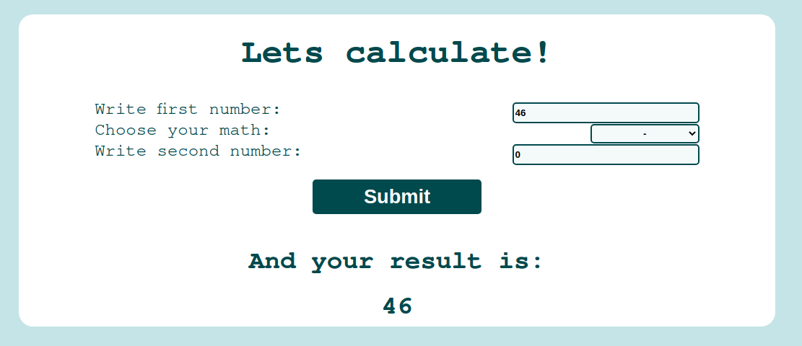

# testForMakai

## To start node server just type "npm start" and enjoy

It's a simple calculator for dividing, multiplicating, adding and subtracting. Based on Node.js and Express for making server side, and with axios.js library to make page responsive and not reloading for show results of calculation.

